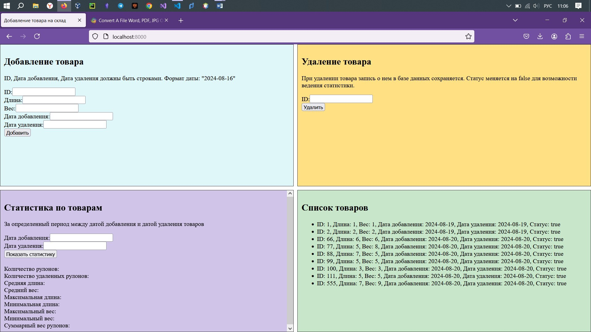
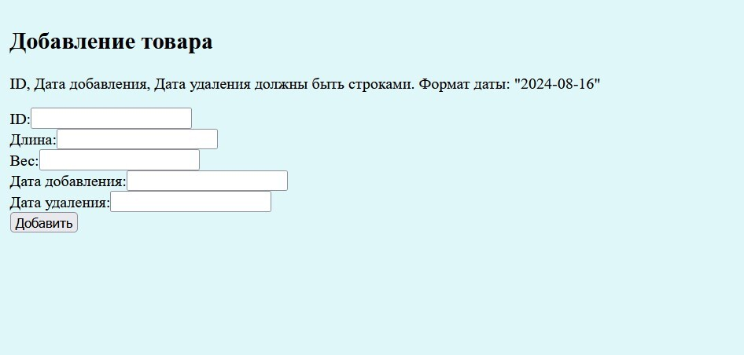
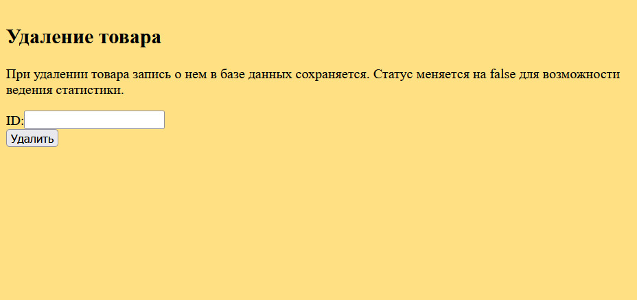
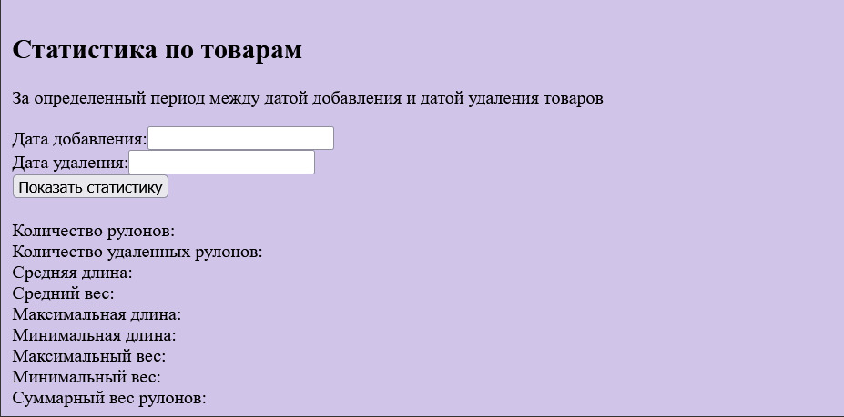
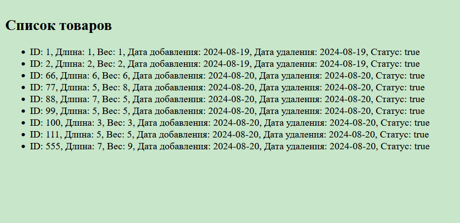

# Full stack сервис добавления товара на склад


Программное обеспечение для добавления товара на склад посредством использования веб-сайта или API запросов с сохранением добавленных позиций в базе данных.

---

## Установка


Для установки необходимо иметь:

- Python 3.8+
- Docker

```bash
git clone https://github.com/defJustAProg/warehouseDjango.git
```

Необходимо указать данные для работы приложения в файле переменных окружения .env в корневой директории проекта:

```
POSTGRES_USER=postgres
POSTGRES_PASSWORD=password
POSTGRES_HOST=database
POSTGRES_PORT=5432
SERVER_HOST=0.0.0.0
SERVER_PORT=8000
BOT_URL=http://bot:8001
BOT_ENABLED=true
BOT_HOST=0.0.0.0
BOT_PORT=8001
BOT_TOKEN=****
POSTGRES_DB=warehouse
```

Далее, находясь в корневой директории проекта выполнить:

```bash
docker-compose up --build
```

для сборки проекта в три контейнера: server - для обработки запросов с сайта или API, database, bot - сервер бота для получения информации о добавленном товаре от сервера и рассылке уведомлений пользователям телеграм.

---

## Взаимодействие с программой и описание ее работы

Перед осуществлением операций добавления и удаления записей о товаре в бд необходимо зарегистрироваться по адресу: "http:<HOST_ADRESS>:<HOST_PORT>/api/accounts/register". Анонимным пользователям доступны только операции просмотра записей бд.

После запуска программы необходимо перейти по адресу хостинга сервера в браузере. Отобразится Интерфейс взаимодействия с базой данных.

Левая верхняя четверть страницы предназначена для добавления товара. При нажатии ''Добавить" данные форма отправятся на сервер, который сделает запись в базе данных, и, если при установке переменная окружения BOT_ENABLED выбрана true, отправит данные на сервер бота. Бот рассылает уведомление о новой записи в базе данных всем пользователям, которые его активировали.

Правая верхняя часть предназначена для удаления товара. После удаления статус товара станет равным false, а сама запись о товаре в базе данных не исчезнет для возможности получения статистики о добавленных товарах за определенный период.

Левая нижняя часть выводит статистику о добавленных товарах за определенный период.

Правая нижняя часть динамически выводит список всех товаров и их состояние, находящихся в базе данных, после каждого добавления или удаления.

---

## Описание API


### Добавление товара

PUT "http://{SERVER_HOST}:{SERVER_PORT}/api/addRoll/"
body = {
	"id": value: UUID4,
	"length": value: int,
	"weight": value: int,
	"put_date": value: str Формат даты: "2024-08-16", 
	"delete_date": value: str Формат даты: "2024-08-16",
	"status": self.status
} Параметры length, weight обязательные.
Пример запроса:

```bash
curl -X PUT "http://{SERVER_HOST}:{SERVER_PORT}/api/addRoll/" \
-H "Content-Type: application/json" \
-d '{
    "id": "example_id",
    "length": 100,
    "weight": 200,
    "put_date": "2024-08-16",
    "delete_date": "2025-08-16",
    "status": "true"
}'
```

### Удаление товара

DELETE "http://{SERVER_HOST}:{SERVER_PORT}/api/delete/"
query = id: str
Пример запроса:

```bash
curl -X DELETE "http://localhost:8080/api/delete/?id=123"
```

### Получение списка товаров с фильтрацией

Запрос возвращает список товаров в базе данных, если парамерт запроса равен "{}" и отсортированный список товаров по нескольким диапазонам одновременно, если диапазоны переданы как параметр.
GET "http://{SERVER_HOST}:{SERVER_PORT}/api/get/"
query = id: str формат: {"id": "value", "length": "value"...}
Пример запроса:

```bash
curl -X GET "http://{SERVER_HOST}:{SERVER_PORT}/api/get/?query={%22id%22:%20%22value%22,%20%22length%22:%20%22value%22}" 
```

### Получение статистики по товарам

GET "http://{SERVER_HOST}:{SERVER_PORT}/api/statistics/"
query = put_date: str, delete_date: str Формат даты: "2024-08-16"
Пример запроса:

```bash
curl -X GET "http://{SERVER_HOST}:{SERVER_PORT}/api/statistics?put_date=2024-08-16&delete_date=2025-08-16"
```
